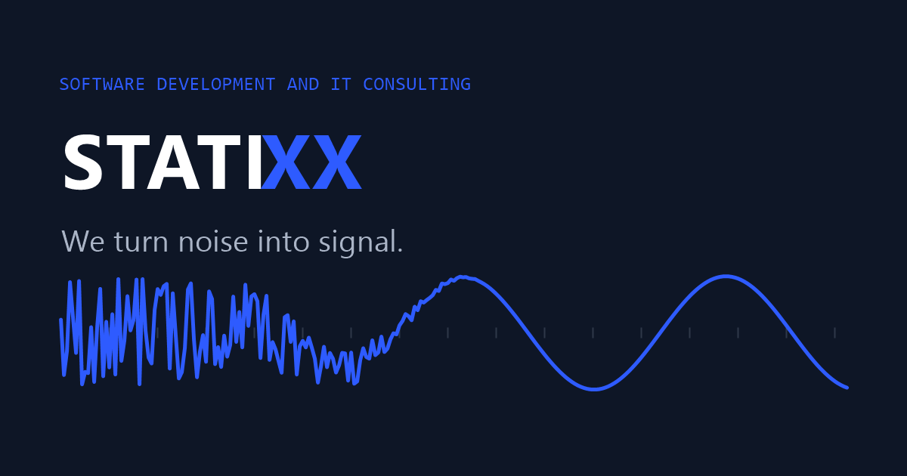

<div align="center">



# STATIXX Solutions

**Custom software for startups and growing businesses.**

Software development and IT consulting, based in Texas — working with clients across the United States.

[**statixx.dev**](https://statixx.dev) &nbsp;·&nbsp; [**contact@statixx.dev**](mailto:contact@statixx.dev)

<br>

`● NOW ACCEPTING NEW PROJECTS`

</div>

---

## We turn noise into signal.

Rough ideas, changing requirements, half-built systems — most projects arrive as a lot of noise and no clear picture. We take what is unclear and deliver software you can ship.

Statixx is a small company **on purpose**. When you hire us, the person you talk to is the person writing the code. Projects move faster, questions get straight answers, and nothing gets lost between departments.

## What we do

| | Service | Typical work |
|---|---|---|
| `01` | **Websites & web applications** | Company sites through full products — user accounts, payments, databases. *React · Node.js · Python* |
| `02` | **AI features** | Support chatbots, document search, automatic summarization and sorting. *OpenAI · Anthropic* |
| `03` | **Online stores** | Builds and fixes on Shopify, WordPress, and custom platforms — payments, shipping, SEO. |
| `04` | **Testing & automation** | Automated test suites that catch bugs before release; automating repetitive manual work. *Selenium · CI/CD* |
| `05` | **System integrations** | Connecting payment providers, CRMs, and inventory systems so data moves without manual entry. |
| `06` | **Ongoing support** | Maintenance and updates after launch — a direct line to your developer, not a ticket queue. |

## How we work

```
SCOPE ────────► BUILD ────────► LAUNCH ────────► SUPPORT
written scope,   staged builds,   full handover:    fixes, changes,
price & timeline you review       code, accounts,   and questions
before any work  working software instructions      as you grow
```

Simple and predictable. You always know what is being built, what it costs, and when it will be done — and **you own everything we build**.

## Stack

`React` `Node.js` `Python` `TypeScript` `C# / .NET` `Java` `PostgreSQL` `MongoDB` `AWS` `Docker` `Selenium` `OpenAI` `Anthropic` `Shopify` `WordPress` `CI/CD`

## Tell us about your project

Send a short note about what you are building and where you are stuck. We reply within **one business day** — and an initial conversation costs nothing.

<div align="center">

### [→ Start a project at statixx.dev](https://statixx.dev/#contact)

Texas, USA — working in every US time zone.

</div>

---

<sub>© 2026 Statixx Solutions. All rights reserved. This repository contains the source for [statixx.dev](https://statixx.dev).</sub>
